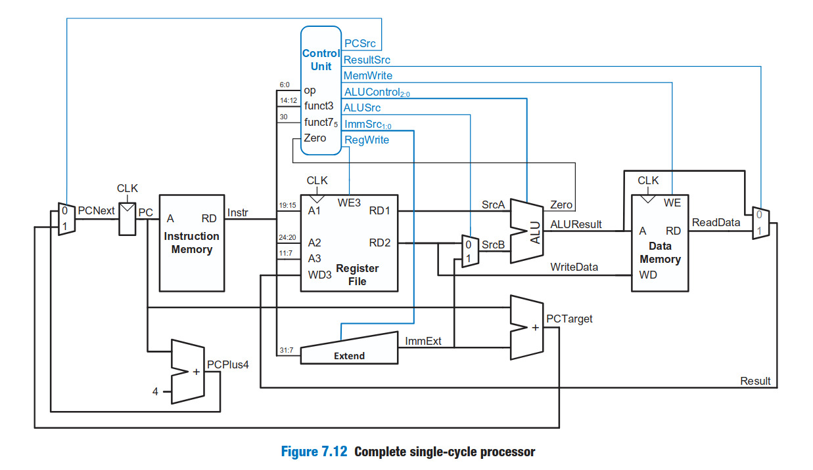

# RISC-V 32-bit Single Cycle Processor

This Folder contains the Verilog implementation of a **RISC-V 32-bit Single Cycle Processor**.
The design follows the standard single-cycle datapath structure and supports a subset of simple RISC-V instructions.
`add`, `sub`, `and`, `or`, `slt`, `beq`, `lw` and `sw` are implemented.

---

## Architecture Diagram

Below is the complete single-cycle processor datapath:



---

## How do we simulate the design ?

Install **Icarus Verilog** and **GTKWave** on your machine and then hit the following commands:

```bash
iverilog -o simv *.v
vvp simv
gtkwave waveform.vcd
```

---

## Verification

The processor was verified using the following hand-written instruction sequence stored in the instruction memory.

|  Address | Instruction      | Description                                                 |
| -------: | ---------------- | ----------------------------------------------------------- |
|  `32'd0` | `lw x1, 4(x0)`   | Load the value stored at memory location 4 into register x1 |
|  `32'd4` | `lw x2, 8(x0)`   | Load the value stored at memory location 8 into register x2 |
|  `32'd8` | `add x3, x2, x1` | Add x2 and x1 and store the result in x3                    |
| `32'd12` | `sw x3, 12(x0)`  | Store the value of x3 into memory location 12               |
| `32'd16` | `beq x1, x2, +8` | Branch to address 24 if x1 equals x2                        |
| `32'd24` | `lw x1, 4(x0)`   | Instruction executed after the branch is taken              |

The following console output is obtained while simulating the above instruction sequence.

```text
--------------------------------
PC =          0
Instruction = 00402083
ALU Result =          4
Zero        = 0
RegWrite = 1
MemWrite    = 0
WriteReg = x1
WriteData(Register) =         10

--------------------------------
PC =          4
Instruction = 00802103
ALU Result =          8
Zero        = 0
RegWrite = 1
MemWrite    = 0
WriteReg = x2
WriteData(Register) =         10

--------------------------------
PC =          8
Instruction = 001101b3
ALU Result =         20
Zero        = 0
RegWrite = 1
MemWrite    = 0
WriteReg = x3
WriteData(Register) =         20

--------------------------------
PC =         12
Instruction = 00302623
ALU Result =         12
Zero        = 0
RegWrite = 0
MemWrite    = 1
WriteData(Memory) = x20

--------------------------------
PC =         16
Instruction = 00208463
ALU Result =          0
Zero        = 1
RegWrite = 0
MemWrite    = 0

--------------------------------
PC =         24
Instruction = 00402083
ALU Result =          4
Zero        = 0
RegWrite = 1
MemWrite    = 0
WriteReg = x1
WriteData(Register) =         10
```

The above simulation output serves as proof that the implemented processor correctly executes the supplied instruction sequence. The console trace verifies the correct operation of:

* Register-register arithmetic (`add`)
* Memory load (`lw`)
* Memory store (`sw`)
* Conditional branching (`beq`)

The generated GTKWave waveform can also be used to verify the correct timing and functionality of the datapath and control signals.
