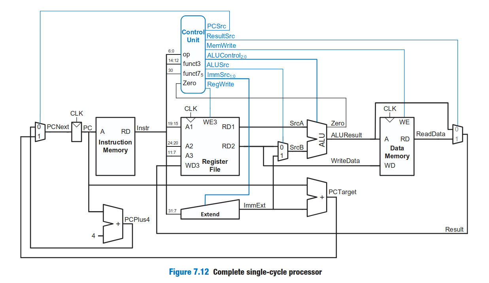
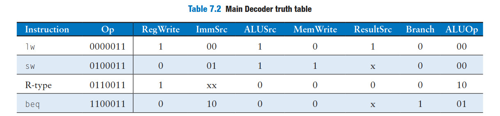
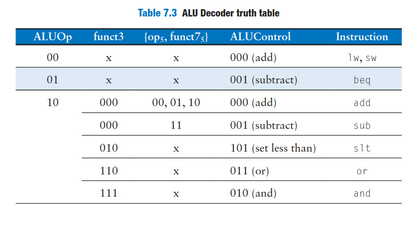

# RISC-V 32-bit Single Cycle Processor

This Folder contains the Verilog implementation of a **RISC-V 32-bit Single Cycle Processor**.  
The design follows the standard single-cycle datapath structure and supports a subset of RISC-V instructions.  

---

##  Architecture Diagram
Below is the complete single-cycle processor datapath:  

---

##  Main Decoder Truth Table
The following truth table defines the **control signals** for each instruction type:  

---

##  Instruction Set
We are using a subset of the **RISC-V RV32I** instruction set in this project:  

