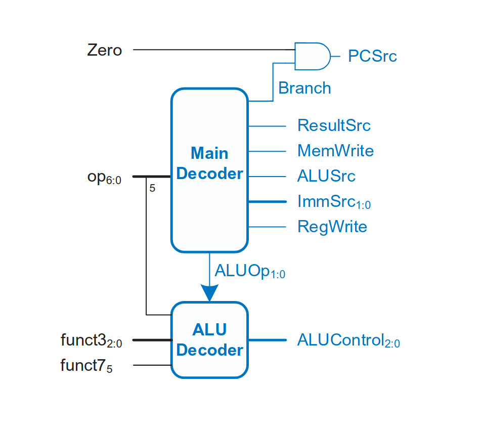

# RISC-V 32-bit Single Cycle Processor

This Folder contains the Verilog implementation of a **RISC-V 32-bit Single Cycle Processor**.  
The design follows the standard single-cycle datapath structure and supports a subset of RISC-V instructions.  
add,sub,and,or,slt,beq,lw and sw is implemented.  

---

##  Architecture Diagram
Below is the complete single-cycle processor datapath:  

---
##  Control Unit
The control unit consists of Main decoder and ALU decoder:  

---

##  Main Decoder Truth Table
Below is the main decoder truth table:  

---

##  ALU Decoder Truth Table
Below is the ALU decoder truth tabe:  

